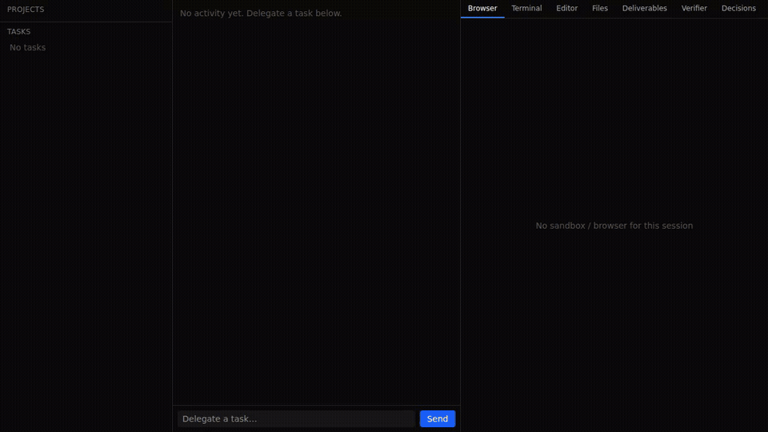

# Seasoned Hand

> **Every task makes the hand wiser.**

An open-source autonomous agent platform.
Deep task execution + learning that persists across sessions.
Self-hosted, model-agnostic, Apache-2.0-licensed.

---

## What this is

A digital employee, not a chatbot.

- **Executes deep tasks** — 50+ tool calls per task (Manus-style)
- **Learns from work** — auto-extracts playbooks from verified outputs (Hermes-style)
- **Runs anywhere** — $5 VPS, NAS, laptop, or cloud
- **Any LLM** — 12-slot model routing through Bifrost gateway

It's a hand that gets seasoned by the work you give it.

## Demo — UI tour



*Delegating a task in the operator console: the Initializer's briefing card
(confirm / edit / cancel), then the AgentComputer's Verifier (verdicts +
evidence chips), Decisions, Deliverables, and Events tabs. Recorded against a
live control plane with demo data ([mp4](docs/assets/ui-tour.mp4)).*

## Status

**v1 shipped — `v0.6.0` (2026-06-18). All six phases complete.** Foundation
(Phase 0), Manus 5-layer deep execution (Phase 1), the employee interface
(Phase 2 — briefing gate, deliverables, provenance, channel framework, durable
pause/resume), the 4-layer learning system (Phase 3), the curator +
self-improvement loop (Phase 4), multi-user + organization (Phase 5 — RBAC,
tenant isolation, audit log, per-user cost ledger, SOP/playbook sharing), and
the **open-source release (Phase 6)** have all shipped. The Dioxus frontend
cutover is complete (the Next.js app was removed in #5 — the UI is now a
unified-Rust Dioxus crate for web/desktop/mobile, per ADR-016), with one-command
Docker deploy and CI/CD auto-release. Grab the release: [GitHub
Releases](https://github.com/slowdoctor-dev/seasoned-hand/releases/tag/v0.6.0) or
`ghcr.io/slowdoctor-dev/seasoned-hand:v0.6.0`. Roadmap:
[`/specs/06-roadmap/ROADMAP.md`](specs/06-roadmap/ROADMAP.md).

See [`CHANGELOG.md`](CHANGELOG.md) for what each phase shipped,
[`BASELINE.md`](BASELINE.md) §6 for the 6-phase roadmap, and
[`/specs/01-architecture/ARCHITECTURE.md`](specs/01-architecture/ARCHITECTURE.md)
for the immutable system design.

## Architecture (one paragraph)

Think of it as an operating system. The **kernel** is a Manus-style agent runtime (Rust + Rig + Tokio). **Syscalls** are 38 tools (file, shell, browser, search, deploy). **User programs** are playbooks — procedures the agent extracts from verified work and reuses next time. A **curator** runs in the background, consolidating and cleaning learning artifacts. **Memory** persists across sessions in SQLite (FTS5 searchable). Tasks run in isolated Docker sandboxes.

## Quick start

```bash
git clone https://github.com/slowdoctor-dev/seasoned-hand
cd seasoned-hand
cp .env.example .env  # fill in API keys
docker compose up -d  # first run builds the control-plane image (compiles Rust + the UI)
open http://localhost:3000
```

`docker compose up -d` brings up Bifrost + Redis + the control plane, which
**self-serves the Dioxus UI** (no separate frontend service). The first build
compiles the Rust binary and the wasm bundle, so it takes a few minutes; later
starts are instant.

**Serving the UI.** The Dioxus UI is a static wasm bundle. For development run it
on its own port with `just dev-ui`. To self-host the whole app as a single binary,
build the bundle and let the control plane serve it:

```bash
just build-ui                 # bundle: crates/seasoned-hand-ui/target/dx/seasoned-hand-ui/release/web/public
SH_UI_DIST=<bundle-dir> cargo run -p seasoned-hand-server   # serves /v1 + /ws + UI
```

With `SH_UI_DIST` unset the server is API-only. Full walkthrough:
[`docs/getting-started.md`](docs/getting-started.md).

## Development methodology

**Spec-Driven Development**. See [`/docs/methodology.md`](docs/methodology.md).

- BMAD personas at phase boundaries
- GSD workflow daily (Discuss → Plan → Execute → Verify)
- Stories = 1-3 hours of work
- Fresh context per story
- All design lives in `/specs/` markdown files

## Repository structure

```
/BASELINE.md           ← single-entry-point (read first)
/AGENTS.md             ← source of truth for AI agents
/CLAUDE.md             ← imports AGENTS.md + Claude-specific
/CHANGELOG.md          ← version history
/GLOSSARY.md           ← project terminology
/specs/                ← living specifications
  /00-philosophy/      ← VISION, PRINCIPLES, NON_GOALS
  /01-architecture/
    ARCHITECTURE.md    ← overall (immutable)
    /decisions/        ← ADR-001 to ADR-018
  /06-roadmap/
    ROADMAP.md
  /07-research/        ← external interviews (e.g., Manus direct Q&A)
  /phase-N/            ← current and future phases
    requirements.md
    stories/
/docs/                 ← human docs (methodology, brand, manifesto, kickoff)
/prompts/              ← BMAD/GSD session prompts
/crates/               ← Rust workspace (core, server, cli, dto) + ui [Dioxus, ADR-016]
/migrations/           ← SQLite schema migrations
/bifrost/              ← Bifrost gateway config
/scripts/              ← dev scripts
/justfile              ← task runner
/docker-compose.yml
```

## Inspiration

- **Manus** (Butterfly Effect) — autonomous task completion, depth
- **Hermes Agent** (Nous Research) — persistent learning, model-agnostic
- **OpenManus** (FoundationAgents) — reference ReAct implementation
- **BMAD-METHOD** — spec-driven development methodology
- **GSD (Get Shit Done)** — AI coding agent workflow

## Phase roadmap

| Phase | Weeks | Deliverable |
|---|---|---|
| 0 | 3 | Foundation: working skeleton, one-line task → result |
| 1 | 4 | Manus 5-layer: deep task completion with verification |
| 2 | 3 | Employee interface: briefing, deliverables, accountability |
| 3 | 4 | Learning system: playbook extraction, FTS5 search |
| 4 | 3 | Curator: auto-maintenance of learning artifacts |
| 5 | 3 | Multi-user: organization, shared SOPs |
| 6 | 2 | Open source release + Dioxus frontend migration (ADR-016) |

## AI tool compatibility

This project is **LLM-agnostic**. Source of truth is `AGENTS.md`. Use any AI coding tool you prefer:

| Tool | Reads AGENTS.md? | Notes |
|---|---|---|
| Claude Code | via CLAUDE.md import | Plan mode + subagents work well for multi-file stories |
| Codex CLI | yes, automatically | Built-in sandbox; use `--profile story` for implementation |
| Cursor 0.50+ | yes, natively | GUI editing experience |
| Cline (VS Code) | yes | Lightweight alternative |
| Aider | partial | Point it at AGENTS.md explicitly |

Switching tools mid-project is fine. Each story runs in a fresh session anyway. Some users keep multiple tools for different tasks (e.g., Claude Code for implementation, Codex for sandboxed experiments).

See [`docs/using-claude-and-codex.md`](docs/using-claude-and-codex.md) for patterns when using multiple tools.

## How to contribute

When public, pick a story from `/specs/phase-N/stories/`, follow the GSD workflow in `/prompts/gsd-execute-story.md`, one PR per story.

See [`CONTRIBUTING.md`](CONTRIBUTING.md) for details.

## License

[Apache License 2.0](LICENSE) — permissive, with an explicit patent grant. No strings.

---

## 한국어

**Every task makes the hand wiser** — 매 작업이 손을 더 영리하게.

오픈소스 자율 에이전트 플랫폼입니다. 한 작업을 끝까지 해내는 깊이(Manus 결)와 시간이 지날수록 자라는 학습(Hermes 결)을 합성. 자체 호스팅 가능, 모델 무관, Apache-2.0 라이선스.

자세한 설계는 [`/specs/01-architecture/ARCHITECTURE.md`](specs/01-architecture/ARCHITECTURE.md)에서.
